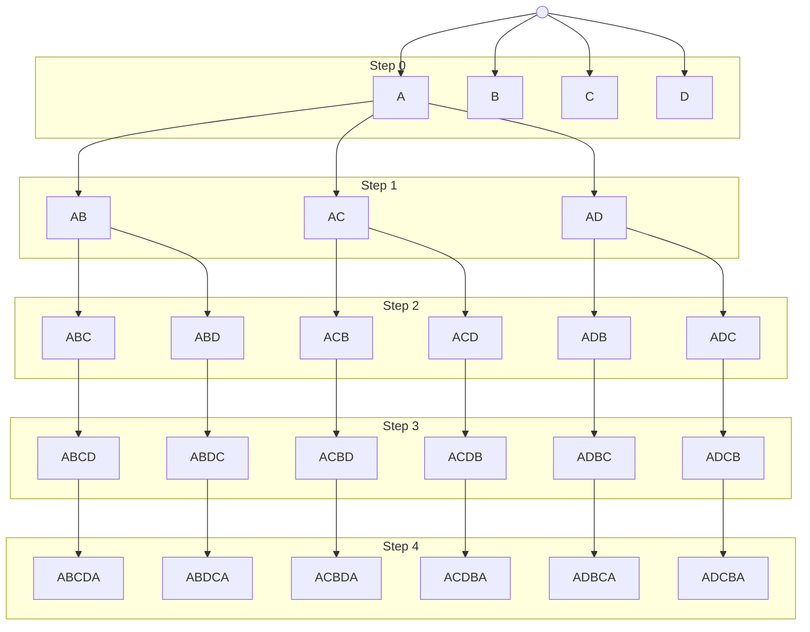

## 1.
#### 1.
The book states this because it's possible that the agent could develop it's own strategy that works better than what would have been prioritized. For machine learning, we are consequential. All that matters is that the agent achieves the outcomes that are expected.
#### 2.
The definition of a rational agent is "For each possible percept sequence, a rational agent should select an action that is expected to maximize its performance measure, given the evidence provided by the percept sequence and whatever built-in knowledge the agent has." According to this definition, an agent isn't irrational if information it doesn't know about would have changed its action had it known about it. As long as they are making the best decision given their knowledge, an agent is rational.
#### 3.
The performance measure would be encoded within the agent function. The agent function has the actions a program would take given any input. In this space, we could weight different actions so the function would be different.
## 2.
#### 1.
At each state, we'd need the **state representation** to know the current city as well as the previously visited cities in the order they have been visited.
We can then combine all of these to form a tree as the entire **state space**.
The **initial state** only has a current city with no previous cities.
The **goal states** have all previous cities visited and the current city is the starting city.
The possible **actions** are:
- If there are unvisited cities, visit one of them
- If there are no unvisited cities, visit the starting city
#### 2.
An example of part of the state space is shown below, only expanding the subtree where we start at A.

#### 3.
From the example above (+ missing subtrees):
- In step 0, there are 4 states
- In step 1, there are 12 states
- In step 2, there are 24 states
- In step 3, there are 24 states
- In step 4, there are 24 states

This can be generalized as:
$$
\begin{array}{c|c}
\text{Step \#} & \text{\# of states} \\
\hline
0 & N \\
1 & N(N-1) \\
2 & N(N-1)(N-2) \\
\vdots & \vdots \\
(N-2) & N(N-1)(N-2)\cdots(3)(2) \\
(N-1) & N(N-1)(N-2)\cdots(3)(2)(1) \\
N & N(N-1)(N-2)\cdots(3)(2)(1)
\end{array}
$$

Notice how the patter continues until step $N$, where the number of states in that step is equal to the number of states in step $(N-1)$. Also notice that if there is only one city, we don't need it to travel anywhere. From this, we can generalize a formula.
$$
S=
\begin{cases}
\sum\limits_{i=0}^{N-1}\prod\limits_{j=0}^{i}(N-j)+\prod\limits_{j=0}^{N-1}(N-j) & N\gt1 \\
1 & N=1
\end{cases}
$$

## 3.
#### 1.
BFS
#### 2.
ID
#### 3.
BFS
## 4.
#### 1.
#### 2.
#### 3.
## 5.
#### 1.
#### 2.
#### 3.
## 6
https://colab.research.google.com/drive/1YSg936dO7X90sxVYAmVByhSoItFl-jpC
