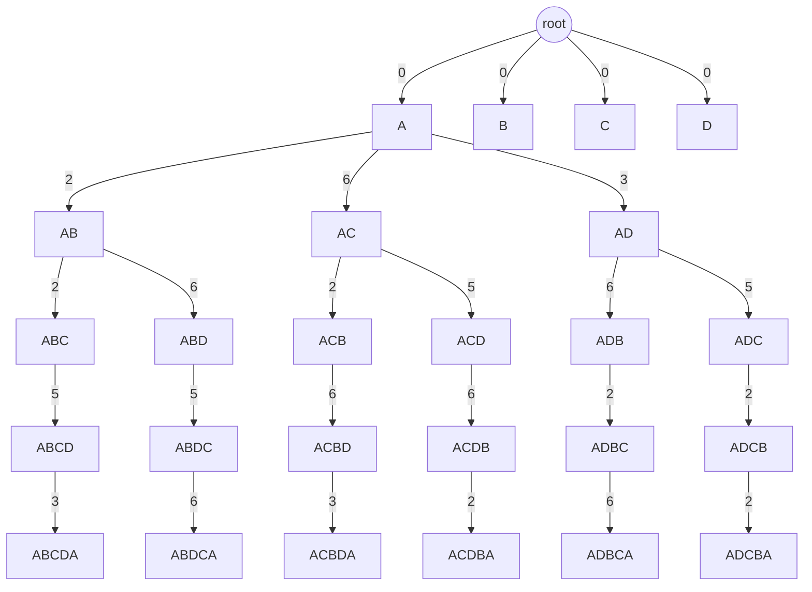

1. 
	1. The book states this because it's possible that the agent could develop it's own strategy that works better than what was mentioned. All that matters is that it achieves the outcomes that are expected.
	2. The definition of a rational agent is "For each possible percept sequence, a rational agent should select an action that is expected to maximize its performance measure, given the evidence provided by the percept sequence and whatever built-in knowledge the agent has." An agent isn't irrational if information it doesn't know about would have changed its action had it known about it, according to this definition. As long as they are making the best decision given their knowledge, an agent is rational.
	3. The performance measure would be encoded within the agent function. The agent function has the actions a program would take given any input. In this space, we could weight different actions so the function would be different.
2. 
	1. Our state space could be a tree where the first level below the root represents the possible initial states. Each lower level would include the current city as well as all previous cities, making sure not to have any duplicates. The lowest level would include all cities, and the first city would also be the last city (this is the only duplicate). The possible actions at any given point are to move along a path to an unvisited city. If all cities are visited, move to the first city.
	2. 
An example of part of the state space is shown below, only expanding the subtree where we start at A.

2. 
	3. In layer 1, there are $N$ states (starting at each city). In layer 2, there are $N(N-1)$ states (for each city, move to one other city). In layer 3, there are $N(N-1)(N-2)$ (for each of the previous states, move to one other city). This continues until the $N\text{-th}$ layer, which has one choice of $N(N-1)(N-2)\cdots(N-(N-2))(N-(N-1))(N-(N-1))$. From summing these, we can create the generic equation as follows.
$$
S=\sum\limits_{i=0}^{N-1}\prod\limits_{j=0}^{i}(N-j)+\prod\limits_{j=0}^{N-1}(N-j)
$$
3. c
	1. a
	2. b
	3. c
4. d
	1. a
	2. b
	3. c
5. e
	1. a
	2. b
	3. c
6. f
	1. a
	2. b
	3. c
	4. d
	5. e