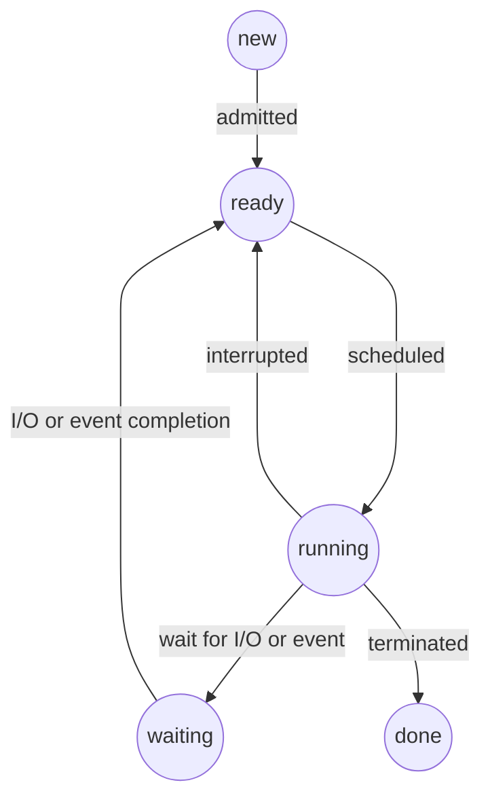

```mermaid
flowchart
A((new)) -->|admitted| B((ready))
B ---->|scheduled| C((running))
C ---->|interrupted| B
C -->|wait for I/O or event| D((waiting))
D -->|I/O or event completion| B
C -->|terminated| E((done))
```

