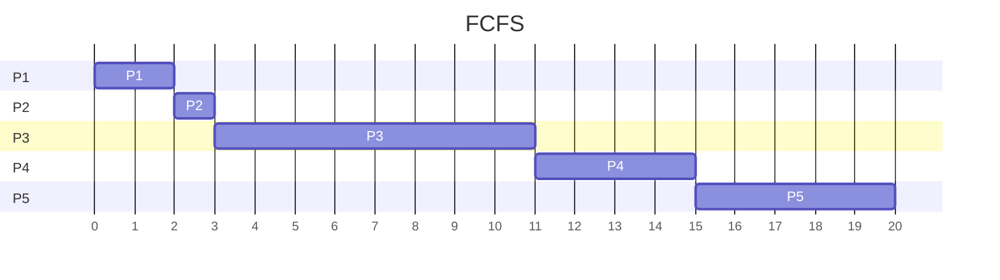
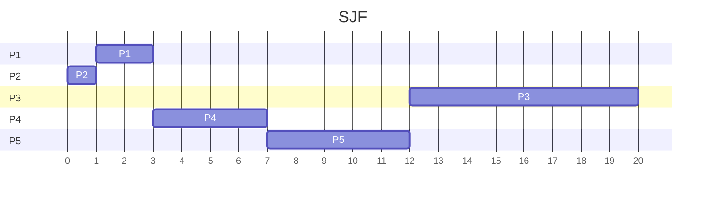
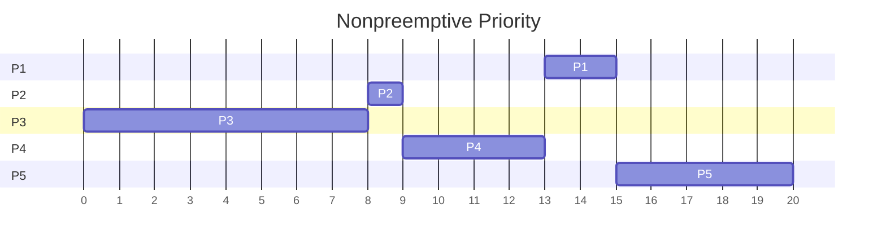
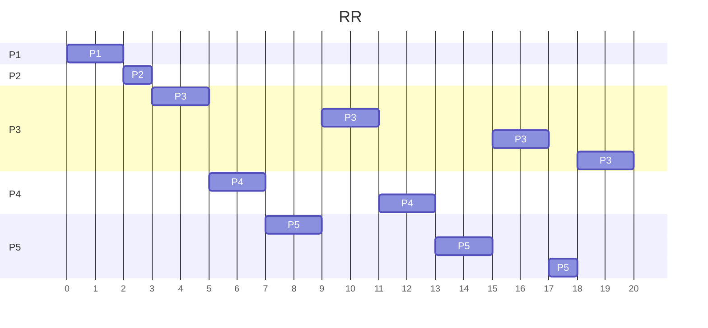
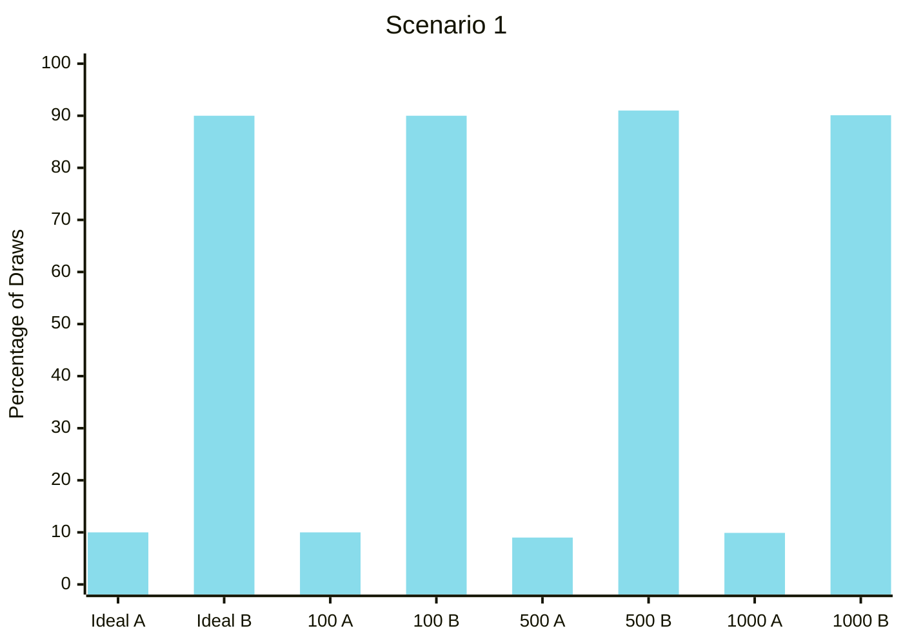
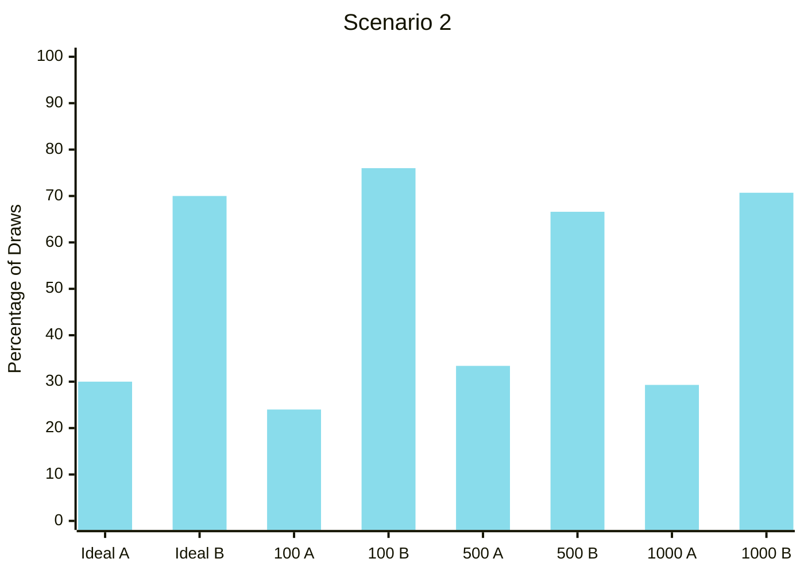
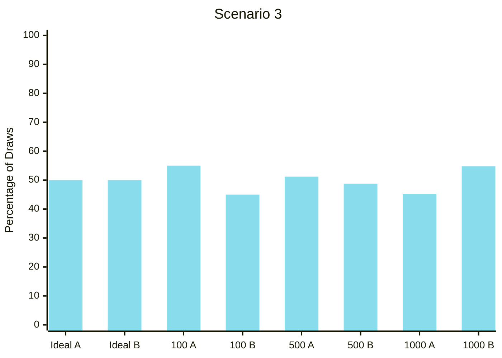

## Problem 1
It allows user level threads to have more kernel level control. It does this by notifying the thread of kernel events and by storing space for thread level context switches.

Scheduler activations differ from kernel threads in that they created each time that a thread needs to be started and freed at each context switch. This means that there are only as many scheduler activations as virtual CPU cores allocated to a process. In contrast, kernel level threads are started and stopped repeatedly.
<div style="page-break-after: always"></div>

## Problem 2
Using: 
$$
\begin{align*}
speedup&\le \frac{1}{S+\frac{1-S}{N}}\\
\text{where}\\
S&= \text{serial portion of program}\\
N&= \text{number of CPUs}
\end{align*}
$$
1) **i)** $1.176$ **ii)** $1.212$
2) **i)** $1.333$ **ii)** $1.6$
3) **i)** $2.909$ **ii)** $3.369$
<div style="page-break-after: always"></div>

## Problem 3
#### 1.




#### 2.

|     | FCFS | SJF | Nonpreemptive Priority | RR  |
| --- | ---- | --- | ---------------------- | --- |
| P1  | 2    | 3   | 15                     | 2   |
| P2  | 3    | 1   | 9                      | 3   |
| P3  | 11   | 20  | 8                      | 20  |
| P4  | 15   | 7   | 13                     | 13  |
| P5  | 20   | 12  | 20                     | 18  |
#### 3.

|     | FCFS | SJF | Nonpreemptive Priority | RR  |
| --- | ---- | --- | ---------------------- | --- |
| P1  | 0    | 1   | 13                     | 0   |
| P2  | 2    | 0   | 8                      | 2   |
| P3  | 3    | 12  | 0                      | 12  |
| P4  | 11   | 3   | 9                      | 9   |
| P5  | 15   | 7   | 15                     | 13  |
#### 4.
$$
\begin{align}
\text{FCFS}=\frac{0+2+3+11+15}{5} & = 6.2\\
\text{SJF}=\frac{1+0+12+3+7}{5} & = 4.6\\
\text{Nonpreemptive Priority}=\frac{13+8+0+9+15}{5} & = 9\\
\text{RR}=\frac{0+2+12+9+13}{5} & = 7.2
\end{align}
$$
SJF has the minimum average wait time.
<div style="page-break-after: always"></div>

## Problem 4
```python
#!/bin/python3

import sys
import random
random.seed()

if len(sys.argv) < 2 or len(sys.argv) > 3:
    print("Usage: ./lottery_sim.py <A tickets> <total draws>")
    exit(1)

aTickets = int(sys.argv[1])
draws = int(sys.argv[2])

aDraws = 0
bDraws = 0
for i in range(draws):
    draw = random.randint(1, 100)
    if draw <= aTickets:
        aDraws += 1
    else:
        bDraws += 1

print("A Draws: " + str(aDraws))
print("B Draws: " + str(bDraws))
```

#### Scenario 1
$100\text{ draws}\to A:10\quad B:90$
$500\text{ draws}\to A:45\quad B:455$
$1000\text{ draws}\to A:99\quad B:901$

This set of tests was very accurate.


#### Scenario 2
$100\text{ draws}\to A:24\quad B:76$
$500\text{ draws}\to A:167\quad B:333$
$1000\text{ draws}\to A:293\quad B:707$

This set of tests was fairly accurate.


#### Scenario 3
$100\text{ draws}\to A:55\quad B:45$
$500\text{ draws}\to A:256\quad B:244$
$1000\text{ draws}\to A:452\quad B:548$

This set of tests stayed generally the same accuracy, even with an increase of draws.



Generally, I would expect the ratio of draws to get more accurate as the number of draws increases.
<div style="page-break-after: always"></div>

## Problem 5
I interpret the equation as saying that if the ratio of the weight of a thread to the weight of all threads is less than or equal to 1 of $p$ processors, the weight is feasible. This means that we don't want to give a thread a weight such that the weight would incentivize it to run on multiple processors, increasing the context switch overhead.

#### Scenario 1
Yes, the threads are violating the above constraint

First, we sort the array decreasing to get $\{ 10, 4, 3, 2, 1, 1 \}$
The first two threads will need to be readjusted according to the algorithm

This becomes $\{ 10, 3.5, 3, 2, 1, 1 \}$ because $4\to \frac{3+2+1+1}{2}=3.5$
and $\boxed{\{ 3.5, 3.5, 3, 2, 1, 1 \}}$ because $10\to \frac{3.5+3+2+1+1}{3}=3.5$

#### Scenario 2
Yes, the threads are violating the above constraint

First, we sort the array decreasing to get $\{ 13, 12, 10, 9, 8, 5, 5, 5, 3, 2, 2, 1 \}$
This time, the first five threads will need to be readjusted according to the algorithm

First, $\{ 13, 12, 10, 9, 7.667, 5, 5, 5, 3, 2, 2, 1 \}$ because $8\to \frac{5+5+5+3+2+2+1}{3}=7.667$
Then, $\{ 13, 12, 10, 7.667, 7.667, 5, 5, 5, 3, 2, 2, 1 \}$ because $9\to \frac{7.667+5+5+5+3+2+2+1}{4}=7.667$
Then, $\{ 13, 12, 7.667, 7.667, 7.667, 5, 5, 5, 3, 2, 2, 1 \}$ because $10\to \frac{7.667+7.667+5+5+5+3+2+2+1}{5}=7.667$
Then, $\{ 13, 7.667, 7.667, 7.667, 7.667, 5, 5, 5, 3, 2, 2, 1 \}$ because $12\to \frac{7.667+7.667+7.667+5+5+5+3+2+2+1}{6}=7.667$
Finally, $\boxed{\{ 7.667, 7.667, 7.667, 7.667, 7.667, 5, 5, 5, 3, 2, 2, 1 \}}$ because $13\to \frac{7.667+7.667+7.667+7.667+5+5+5+3+2+2+1}{7}=7.667$
<div style="page-break-after: always"></div>

## Problem 6
Yes, Earliest Deadline First schedule is possible because the thread utilization is less than 1. This is how that would look.

```mermaid
gantt
dateFormat s
axisFormat %_S
title EDS

section T1
	T1 :t11, 7, 1s
	T1 :t12, 10, 2s
section T2
	T2 :t21, 2, 1s
section T3
	T3 :t31, 0, 2s
	T3 :t32, 3, 4s
section T4
	T4 :t41, 8, 2s
```

<div style="page-break-after: always"></div>

## Problem 7
#### Case 1
All threads get locked up at the beginning because the semaphore values are smaller than the number of semaphore waits.
#### Case 2
We execute $T_{1}$, then $T_{2}$, then $T_{3}$.
#### Case 3
We execute $T_{2}$ and then $T_{1}$. $T_{3}$ is blocked.
#### Case 4
We execute $T_{2}$ and then $T_{3}$. $T_{1}$ is blocked.
<div style="page-break-after: always"></div>

## Problem 8
If the threads are implemented in the kernel, they should be able to synchronize using a kernel semaphore. Assuming there are no scheduler activations, if the threads are implemented in user space, a kernel semaphore will be unable to synchronize the threads. This is because there will be no link between the kernel semaphore and the user threads: both are unaware of the other.
<div style="page-break-after: always"></div>

## Problem 9
If two threads store the value of `counter` into `temp` before either sets the value of `counter` again, then the result of calling `increment_counter()` twice will be 1, when it would be 2 otherwise.

```c
int counter = 0;
void increment_counter() {
	int temp = counter;
	
	while (compare_and_swap(&counter, temp, temp + 1) == temp)
		temp = counter;
}
```
<div style="page-break-after: always"></div>

## Problem 10
We need the critical section to be basically everywhere because we can only dispense once at any time and we don't want the available bills to be incorrectly read or changed.

```c
int availableBills;
int turn;
boolean flag[2];

function ATM(int i, int j) {
	int amount = customerRequest;

	flag[i] = true;
	turn = i;
	while (flag[j] && turn == j);
	
	if (amount > availableBills) {
	
	} else {
		availableBills -= amount;
		dispenseCash(amount);
	}

	flag[i] = false;
}
```
<div style="page-break-after: always"></div>

## Problem 11
There are no race conditions in the above code. The line 3 conditional ensures that the first set of additions will happen before we would have a race condition. An example race condition this negates is if the addition from spots 1 and 3 happened before the addition from spots 0 and 1.