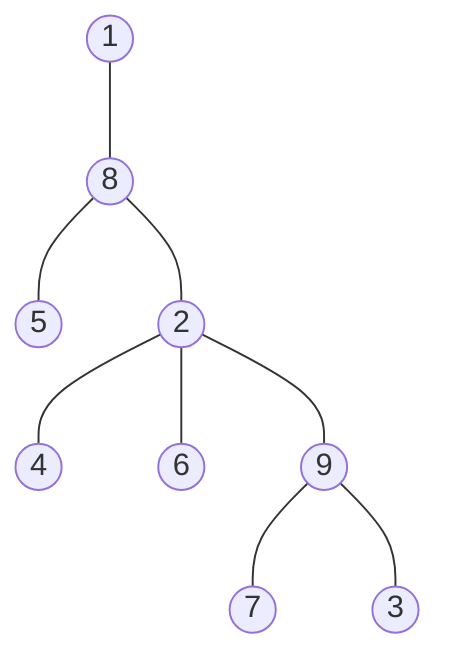
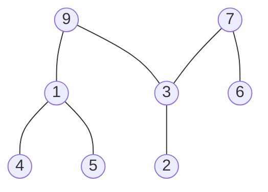

\# [[Trees#Spanning Trees|spanning trees]] in $K_{n}$ is $n^{n-2}$
*Proof:* Prüfer code.
Bijection: trees in $K_{n}\Leftrightarrow$ words in alphabet with $n$ letters with length $n-2$.

# Prüfer Code
1) Label vertices of $K_{n}$ with $1,2,\dots,n$.
2) Start with $T_{1}=T$, and build $T_{2},T_{3},\dots,T_{n-1}$ so that $T_{i}$ has $n-i+1$ vertices. 
3) Let $x_{i}$ be the least [[Degree|leaf]] of $T_{i}$.
4) Delete $x_{i}$ and its edge $(x_{i}y_{i})$.
5) Get $T_{i+1}$. Record $y_{i}$.

## Examples
### Creating a code

| $i$ | $x_{i}$ | $y_{i}$ |
| --- | ------- | ------- |
|  $1$   |    $1$     |    $8$     |
|  $2$   |  $3$       |   $9$      |
|  $3$   |   $4$      |   $2$      |
| $4$    |    $5$     |    $8$     |
|  $5$   |   $6$      |   $2$      |
|  $6$   |    $7$     |    $9$     |
|  $7$   |   $8$      |   $2$      |
|  $8$   |  $2$       |         |

$\therefore$ our code is $8\,9\,2\,8\,2\,9\,2$

### Creating a tree from a code
Code: $3\,1\,1\,9\,7\,3\,9$

